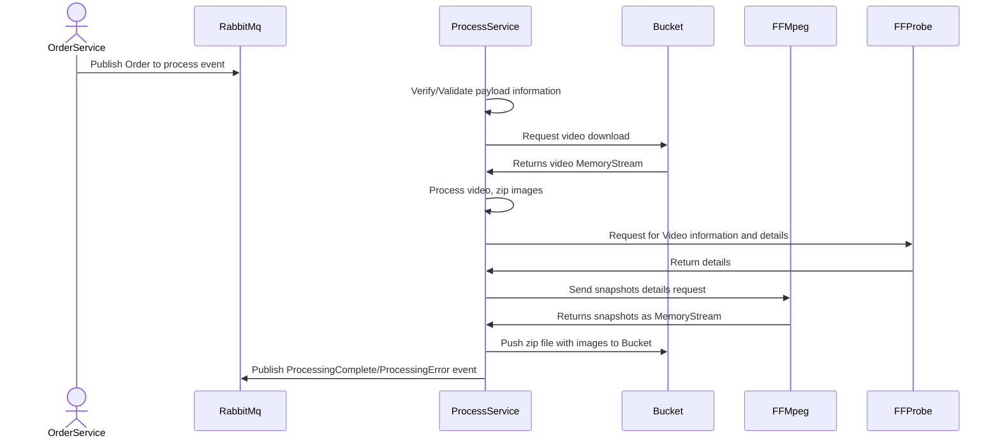

# FrameUp Processing Service

The Processing Service is designed to process a video and extract thumbnails based on a given parameters. The video should be previously stored at a Bucket/BlobStorage and it expected to be done by [FrameUp.OrderService](https://github.com/Team-One-Pos-Tech/FrameUp.OrderService)

## Running the application

***This project makes use of Shared Workflows***
In order to have a standard environment and containers, this project makes use of [shared workflows](https://github.com/Team-One-Pos-Tech/FrameUp.OrderService), it means that this repository won't have a docker file, in order to run it, we recommend to execute the docker compose file under the folder '/deploy'.
It will get the [latest images published at our repository registry](https://github.com/orgs/Team-One-Pos-Tech/packages?repo_name=FrameUp.ProcessService) and will set up all the necessary dependencies.

In short, navigate to the ./deploy folder in your terminal and execute:

```sh
   docker-compose up -d
```

## External dependencies 
This project relies on some external libraries and tooling to properly work, even though most of them will be setup and configured automatically, one of them will need an extra step in order to debug or execute directly from an IDE or developer environment.

### FFMPEG Core library
In order to extract snapshots from a video, this application uses [FFMPEGCore library](https://github.com/rosenbjerg/FFMpegCore), however, this nuget package counts with some binaries at the host machine, those dependencies can [found here](https://github.com/rosenbjerg/FFMpegCore?tab=readme-ov-file#installation).
If you are at a Linux or MacOS environment, this application will be able to configure it for you, so, no necessary extra steps are needed, however, if you are on a Windows environment, you will need to download the windows-x64 versions of ffmpeg and ffprobe and copy them to the application execution folder, you can find them [at this page](https://ffbinaries.com/downloads) 

## Sequence diagrams


#### Execution path:



